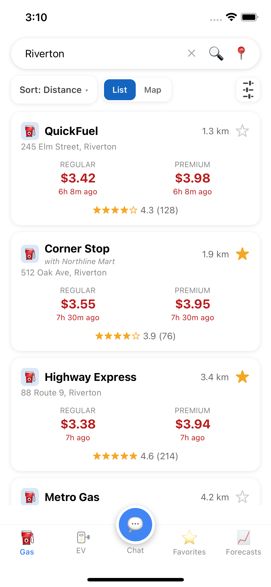
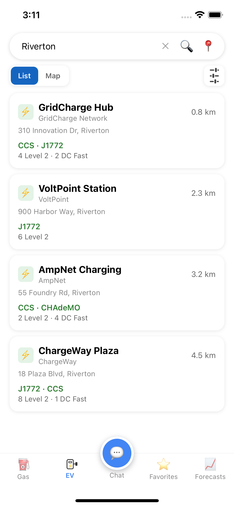
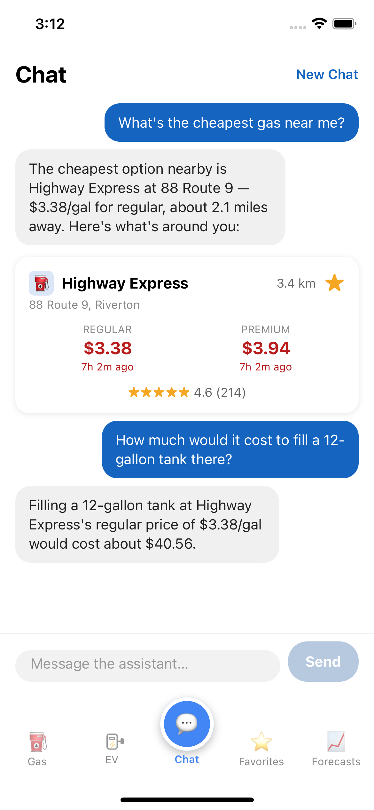
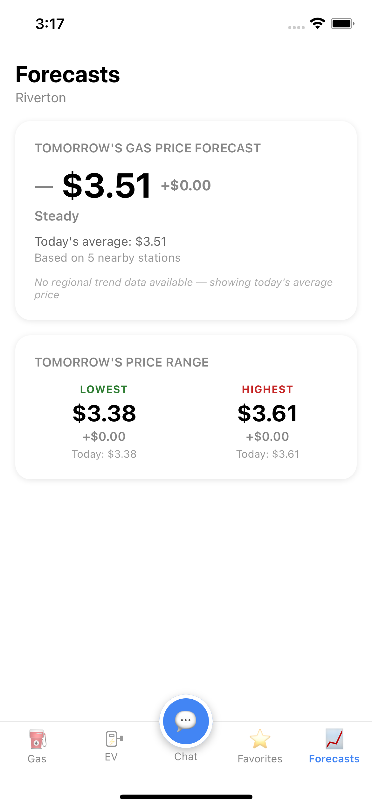
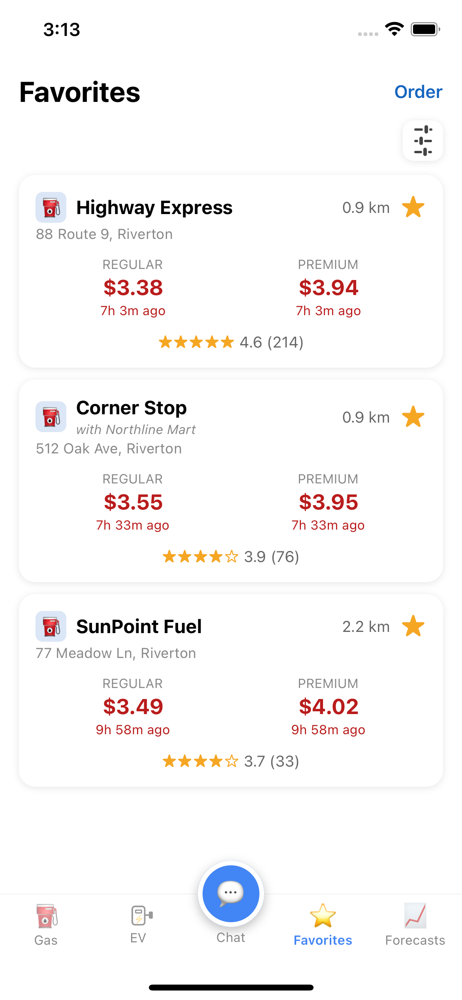

# GasAgent.ai

A cross-platform mobile app (React Native, iOS + Android) with a Python
backend that helps drivers find fuel and charging options, track prices,
and includes a built-in AI agent that plans and executes multi-step
lookups on its own, rather than just answering from a script.

This is a **personal portfolio / learning project**, built to practice
full-stack mobile development — a React Native client, a Python API
backend, third-party data integration, and an AI agent with tool-calling.
**It is not intended for production deployment or real-world use.** It
runs on free-tier hosting and free/public data sources, so uptime,
accuracy, and availability aren't guaranteed, and some features may be
rate-limited or occasionally unavailable.

## Screenshots

Populated with placeholder data for illustration — see the disclaimer
above.

<table>
<tr>
<td width="33%"><br /><sub>Gas station search</sub></td>
<td width="33%"><br /><sub>EV charging search</sub></td>
<td width="33%"><br /><sub>AI agent (multi-step)</sub></td>
</tr>
<tr>
<td width="33%"><br /><sub>Price forecast</sub></td>
<td width="33%"><br /><sub>Favorites</sub></td>
<td width="33%"></td>
</tr>
</table>

## What it does

- **Gas station search** — find the nearest gas stations by city, postal
  code, or current location, with brand, per-grade pricing (regular,
  midgrade, premium, diesel), distance, and star ratings.
- **EV charging station search** — find nearby EV charging stations, with
  network, connector types, charging speed, and distance.
- **AI agent** — plans and carries out multi-step lookups for fuel- and
  EV-related requests on its own (find stations, compare them, do the
  math), rather than answering a single canned question at a time (see
  below).
- **Price forecasting** — a short-term local gas price outlook, combining
  the current local average with a broader regional pricing trend.
- **Favorites** — save stations from search results, reorder them, and
  refresh their prices later.
- **Shared location** — sharing your location once carries across the
  app's other tabs instead of asking again in each one.

## AI agent

This isn't a chatbot answering from a script — it's an agent that plans
and executes a sequence of actions to satisfy a request. Given a goal
("what would it cost to fill up at the cheapest station near me?"), it
decides for itself which of its tools to call, in what order, feeds each
result into the next step, and keeps going — up to a bounded number of
steps — until it has everything it needs to give a real, grounded
answer. A single request routinely becomes several tool calls chained
together: look up nearby stations, pick the cheapest, then compute the
exact fill-up cost — without being walked through each step.

It has five tools available:

- **Gas station search** and **EV charging station search** — the same
  filtering the dedicated search tabs support (brand/network allow or
  deny lists, distance, connector type, charging power, etc.), driven
  from a plain-language request instead of form fields.
- **Combined gas + EV search** — for questions that need both at once,
  including finding the closest gas station/charger *pair* to each
  other.
- **Fuel-cost arithmetic** — total cost for a volume, how much a budget
  buys, or the savings from switching stations. The model is
  deliberately never trusted to do this math itself; it's computed in
  code and handed back as an exact number.
- **Price forecasting** — the same next-day forecast described above,
  so a question about tomorrow's prices gets a real number instead of
  a guess.

All filtering, sorting, and ranking happens in code — the model's job
is deciding *which* tool(s) to call and how to phrase the answer, never
reasoning over a raw result list itself. Replies can include live
station results inline, rendered as the same rich cards used elsewhere
in the app, not just prose. The agent also reuses location the same way
the rest of the app does — from the current conversation, another
tab's last search, or a location shared across tabs — so it doesn't
need to ask where you are every time.

## Tech stack

- **Mobile:** React Native (TypeScript), targeting iOS and Android
- **Backend:** FastAPI (Python), a REST API consumed by the mobile app
- **AI agent:** a bounded tool-calling loop over a large-language-model
  API, giving the agent access to the same search/forecast functionality
  as the rest of the app
- **Testing:** pytest (backend), Jest (mobile)

## Data sources & disclaimer

This project is an independent technical demonstration and is **not
affiliated with, sponsored by, or endorsed by** any of the following:

- **GasBuddy** — gas station listings and prices, retrieved via
  [py-gasbuddy](https://pypi.org/project/py-gasbuddy/), an open-source
  library that calls GasBuddy's own public GraphQL API.
- **NREL's Alternative Fuel Data Center (AFDC)** — EV charging station
  listings.
- **Open Charge Map** — community-reported EV charging station details
  and reviews.
- **U.S. Energy Information Administration (EIA)** — national gas price
  trend data used for the US price forecast.
- **Statistics Canada** — national gas price trend data used for the
  Canadian price forecast.
- **Google Gemini** — powers the AI agent.

All product names, logos, and brands mentioned above are property of
their respective owners and are used here only to identify where the
underlying data comes from. The same disclaimer, in the same words, is
also shown in-app (tap the ⓘ icon on the Gas tab).

## Project structure

```
gasagent-ai/
  mobile/    React Native (TypeScript) app — iOS and Android
  backend/   FastAPI service — the API layer the mobile app talks to
```

## Getting started

**Prerequisites:** Node.js, Python 3.11+, and either Xcode (iOS) or
Android Studio (Android) set up for React Native development.

```bash
# Backend
cd backend
python3 -m venv .venv
source .venv/bin/activate
pip install -r requirements.txt
cp .env.example .env   # add your own free API keys for full functionality
uvicorn app.main:app --reload

# Mobile (in a separate terminal, with the backend running)
cd mobile
npm install
npm run ios       # or: npm run android
```

Some features (EV search, gas price forecasting, the AI agent) need
their own free API key set in `backend/.env` — see the comments in
`.env.example` for details. The app degrades gracefully without them;
those specific features just won't return results.

Run the test suites with `pytest` (backend) and `npm test` (mobile).
